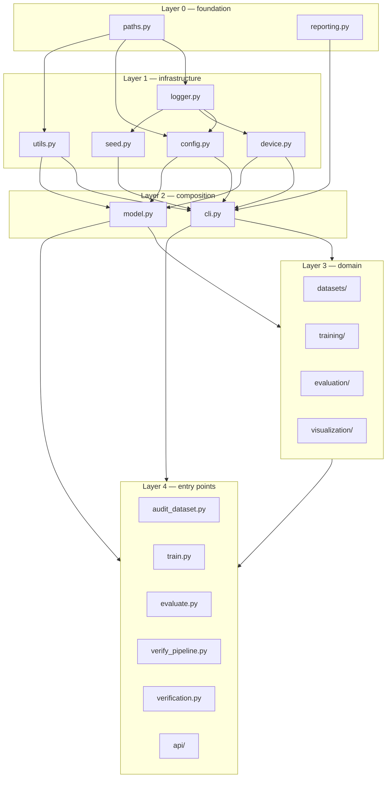
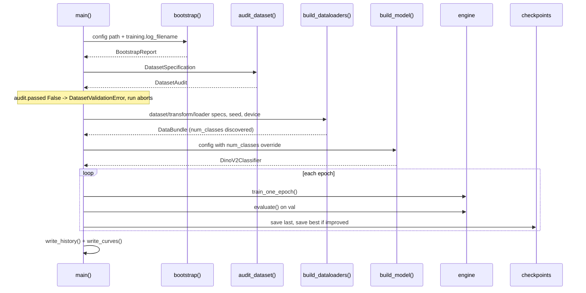
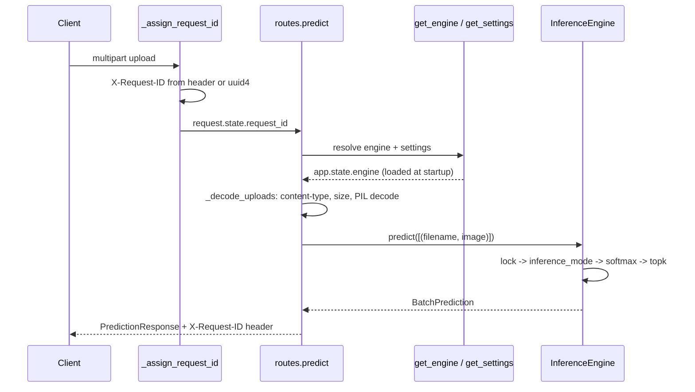

# Architecture

## Package layout

| Package | Files | Responsibility | Source |
| --- | --- | --- | --- |
| `src` (root) | 14 modules | Infrastructure + CLI entry points | [src/](../src/) |
| `src.datasets` | 4 | Audit, transforms, dataloaders | [src/datasets/](../src/datasets/) |
| `src.training` | 7 | Engine, optim, checkpoints, metrics, early stopping, precision | [src/training/](../src/training/) |
| `src.evaluation` | 5 | Inference pass, metrics, integrity, reporting | [src/evaluation/](../src/evaluation/) |
| `src.visualization` | 3 | Training curves, evaluation figures | [src/visualization/](../src/visualization/) |
| `src.api` | 8 | FastAPI inference service | [src/api/](../src/api/) |

## Layering

Verified by import inspection of every module in `src`. No import cycles exist —
each module was confirmed importable as the first import in a fresh interpreter.

### Shared-bootstrap coupling

`bootstrap()` and `build_parser()` live in [src/cli.py](../src/cli.py) and are
imported by every other entry point:

| Importer | Source |
| --- | --- |
| `src/verification.py` | [src/verification.py:16](../src/verification.py) |
| `src/audit_dataset.py` | [src/audit_dataset.py](../src/audit_dataset.py) |
| `src/train.py` | [src/train.py](../src/train.py) |
| `src/evaluate.py` | [src/evaluate.py](../src/evaluate.py) |
| `src/verify_pipeline.py` | [src/verify_pipeline.py](../src/verify_pipeline.py) |

`src/api/main.py` imports only `DEFAULT_CONFIG_PATH` from `src.cli` and performs
its own initialisation in `_prepare()` ([src/api/main.py:82](../src/api/main.py)).

## `bootstrap()` sequence

Implemented in [src/cli.py:81](../src/cli.py). Steps execute in fixed order; the
first failure aborts.

| Order | Step | Function | Source |
| --- | --- | --- | --- |
| 1 | Load + validate config | `load_config` | [src/config.py:130](../src/config.py) |
| 2 | Configure logging | `configure_logging` | [src/logger.py:44](../src/logger.py) |
| 3 | Seed RNGs + cuDNN flags | `set_seed` | [src/seed.py:22](../src/seed.py) |
| 4 | Create directories | `ProjectPaths.create` | [src/paths.py:75](../src/paths.py) |
| 5 | Resolve device | `get_device` / `get_device_info` | [src/device.py:36](../src/device.py) |

Returns `BootstrapReport` ([src/cli.py:48](../src/cli.py)) carrying `config`,
`paths`, `device_info`, `completed_steps`, `duration_seconds`.

`bootstrap` accepts a keyword-only `log_filename` so each entry point writes its
own log file ([src/cli.py:81](../src/cli.py)).

## Execution flows

### Training — `python -m src.train`

Source: `run_training` [src/train.py:137](../src/train.py); the audit gate is
`_gate_on_dataset_audit` [src/train.py](../src/train.py).

### Evaluation — `python -m src.evaluate`

Ordering matters for the integrity guarantees; verified in `run_evaluation`
([src/evaluate.py:137](../src/evaluate.py)):

| Order | Action | Source |
| --- | --- | --- |
| 1 | Audit dataset, abort on error | `_build_bundle` |
| 2 | Build dataloaders, select split | `_select_loader` |
| 3 | `fingerprint_file` checkpoint (**before**) | [src/evaluation/integrity.py:68](../src/evaluation/integrity.py) |
| 4 | Build model, `load_model_checkpoint` | [src/training/checkpoints.py:198](../src/training/checkpoints.py) |
| 5 | `parameter_digest` (**before**) | [src/evaluation/integrity.py:86](../src/evaluation/integrity.py) |
| 6 | `run_inference` | [src/evaluation/inference.py:139](../src/evaluation/inference.py) |
| 7 | `parameter_digest` + `fingerprint_file` (**after**) | same |
| 8 | 7 integrity checks, `enforce()` raises on any failure | [src/evaluation/integrity.py:199](../src/evaluation/integrity.py) |
| 9 | `compute_metrics` | [src/evaluation/metrics.py:234](../src/evaluation/metrics.py) |
| 10 | `benchmark_inference` | [src/evaluation/inference.py:208](../src/evaluation/inference.py) |
| 11 | Write reports + figures | [src/evaluation/reporting.py:62](../src/evaluation/reporting.py) |

### API request — `POST /predict`

Source: [src/api/main.py:143](../src/api/main.py) (middleware),
[src/api/routes.py:114](../src/api/routes.py) (handler),
[src/api/inference.py:174](../src/api/inference.py) (engine).

## Cross-cutting mechanisms

| Mechanism | Implementation | Source |
| --- | --- | --- |
| Config access | Dotted keys, deep-copied on every `get` | [src/config.py:64](../src/config.py) |
| Config contracts | `validate_keys` reports **all** problems, not the first | [src/config.py:189](../src/config.py) |
| Runtime override | `with_overrides` returns a new `Config` | [src/config.py:167](../src/config.py) |
| Logging | Single root logger `dinov2_leafcare`, idempotent reconfiguration | [src/logger.py:17](../src/logger.py) |
| Path resolution | All relative paths anchored at repo root | [src/paths.py:27](../src/paths.py) |
| Determinism | `set_seed` seeds `random`, NumPy, torch, CUDA + cuDNN flags | [src/seed.py:22](../src/seed.py) |
| Console reports | Shared banner/rule/entry primitives | [src/reporting.py](../src/reporting.py) |

## Specification pattern

Every subsystem declares a required-key tuple and a frozen dataclass with
`from_config`. Verified instances:

| Specification | Config section | Source |
| --- | --- | --- |
| `ModelSpecification` | `model` | [src/model.py:77](../src/model.py) |
| `ClassifierSpecification` | `classifier` | [src/model.py:127](../src/model.py) |
| `DatasetSpecification` | `dataset` | [src/datasets/validation.py:194](../src/datasets/validation.py) |
| `TransformSpecification` | `dataset` + `model.image_size` | [src/datasets/transforms.py:64](../src/datasets/transforms.py) |
| `DataLoaderSpecification` | `dataloader` | [src/datasets/loaders.py:51](../src/datasets/loaders.py) |
| `PrecisionSpecification` | `training.amp` | [src/training/precision.py](../src/training/precision.py) |
| `OptimizerSpecification` | `training.optimizer` | [src/training/optim.py](../src/training/optim.py) |
| `SchedulerSpecification` | `training.scheduler` | [src/training/optim.py](../src/training/optim.py) |
| `EarlyStoppingSpecification` | `training.early_stopping` | [src/training/early_stopping.py](../src/training/early_stopping.py) |
| `CheckpointSpecification` | `training.checkpoints` | [src/training/checkpoints.py:64](../src/training/checkpoints.py) |
| `PlotSpecification` | `visualization` | [src/visualization/plots.py](../src/visualization/plots.py) |
| `EvaluationPlotSpecification` | `evaluation.filenames` + `visualization` | [src/visualization/evaluation_plots.py](../src/visualization/evaluation_plots.py) |
| `BenchmarkSpecification` | `evaluation.benchmark` | [src/evaluation/inference.py:68](../src/evaluation/inference.py) |
| `ReportFilenames` | `evaluation.filenames` | [src/evaluation/reporting.py:36](../src/evaluation/reporting.py) |
| `EvaluationSettings` | `evaluation` | [src/evaluate.py:78](../src/evaluate.py) |
| `ApiSettings` | `api` + `project.version` | [src/api/settings.py:28](../src/api/settings.py) |

## Third-party dependency use

| Package | Used in | Source |
| --- | --- | --- |
| `torch`, `torchvision` | model, datasets, training, evaluation, api | throughout |
| `numpy` | seed, metrics, loaders, plots | [src/evaluation/metrics.py](../src/evaluation/metrics.py) |
| `pyyaml` | config loading only | [src/config.py:14](../src/config.py) |
| `pillow` | dataset audit, API image decode | [src/datasets/validation.py](../src/datasets/validation.py), [src/api/inference.py](../src/api/inference.py) |
| `tqdm` | training + evaluation progress bars | [src/training/engine.py](../src/training/engine.py) |
| `matplotlib` | all figures, `Agg` backend | [src/visualization/plots.py](../src/visualization/plots.py) |
| `scikit-learn` | evaluation metrics + curve data | [src/evaluation/metrics.py:15](../src/evaluation/metrics.py) |
| `fastapi`, `uvicorn`, `python-multipart` | API | [src/api/](../src/api/) |

Every declared runtime dependency is imported by `src`. `python-multipart` is the
exception by design: FastAPI imports it internally to parse the `multipart/form-data`
uploads the `/predict` routes accept.
