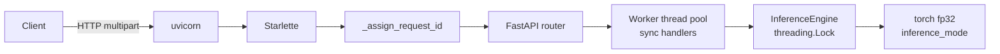

# Deployment

## Toolchain

| Item | Value | Source |
| --- | --- | --- |
| Package manager | `uv` | [pyproject.toml](../pyproject.toml), [uv.lock](../uv.lock) |
| Python | `>=3.11` | [pyproject.toml:6](../pyproject.toml) |
| Build backend | **Not Found** — no `[build-system]` table | [pyproject.toml](../pyproject.toml) |
| Container / Dockerfile | **Not Found** | — |
| CI configuration | **Not Found** — no `.github/`, CI yaml or pre-commit config | — |
| Process manager / systemd unit | **Not Found** | — |
| Reverse proxy config | **Not Found** | — |

The project is run from a source checkout; there is no packaging or container
definition in the repository.

## Runtime dependencies

Declared in [pyproject.toml](../pyproject.toml):

| Package | Constraint | Used by |
| --- | --- | --- |
| `numpy` | `>=2.4.6` | seed, metrics, loaders, plots |
| `pyyaml` | `>=6.0.3` | config loading |
| `pillow` | `>=11.0.0` | dataset audit, API image decode |
| `tqdm` | `>=4.66.0` | progress bars |
| `matplotlib` | `>=3.9.0` | figures |
| `scikit-learn` | `>=1.5.0` | evaluation metrics |
| `fastapi` | `>=0.115.0` | API |
| `uvicorn[standard]` | `>=0.32.0` | ASGI server |
| `python-multipart` | `>=0.0.12` | multipart upload parsing |
| `torch` | unpinned | everything |
| `torchvision` | unpinned | transforms, `ImageFolder` |

Eleven runtime dependencies, all of them reached by `src`. Dev group:
`ruff>=0.16.3`, `httpx>=0.28.0` (the latter backs
`fastapi.testclient.TestClient`).

> `torch` and `torchvision` carry **no version floors**. Pinning is supplied
> solely by `uv.lock`. A fresh `uv lock` on another machine could resolve a
> different torch. See [CODEMAP.md](CODEMAP.md#technical-debt).

## CUDA wheel pinning

```toml
[[tool.uv.index]]
name = "pytorch-cu130"
url = "https://download.pytorch.org/whl/cu130"
explicit = true

[tool.uv.sources]
torch = { index = "pytorch-cu130" }
torchvision = { index = "pytorch-cu130" }
```

Source: [pyproject.toml](../pyproject.toml). Both torch packages resolve from the
CUDA 13.0 index rather than PyPI. Without this, the Windows PyPI wheel is
CPU-only.

## Install

```bash
uv venv
uv sync
```

`uv sync` installs the runtime and `dev` groups and reproduces `uv.lock`.

## Model artifacts required at runtime

| Consumer | Needs | Notes |
| --- | --- | --- |
| `src.model` (verification) | `torch.hub` DINOv2 repo + pretrained `.pth` | Downloads on first use |
| `src.train` | repo + `.pth` + `data/` | Full dataset audit runs first |
| `src.evaluate` | repo + `checkpoints/best_model.pt` + `data/` | Audits the whole dataset |
| **API** | repo + `checkpoints/best_model.pt` | **`data/` not required** |

The API builds the architecture from the checkpoint's stored config
([src/api/inference.py:308](../src/api/inference.py)), so a serving deployment
needs the `torch.hub` cache and the checkpoint file, not the dataset.

`torch.hub` cache location is `torch.hub.get_dir()`; the repository sets **no**
`TORCH_HOME` or `HF_HOME` override.

## Startup sequence — API

| Phase | Work | Source |
| --- | --- | --- |
| Import `src.api.main` | `create_app()` → `_prepare()`: load config, configure logging to `logs/api.log`, create `logs/`, `checkpoints/`, `results/`, `set_seed` | [main.py:82](../src/api/main.py) |
| Lifespan startup | Set `app.state.settings`; `_load_engine` reads `checkpoints/best_model.pt`, rebuilds the model, loads weights, fingerprints the file | [main.py:115](../src/api/main.py) |
| Serving | `app.state.engine` reused for every request | [dependencies.py:26](../src/api/dependencies.py) |
| Lifespan shutdown | `app.state.engine = None` | [main.py:123](../src/api/main.py) |

Importing the module does **not** load weights; the checkpoint read happens in the
lifespan handler.

**Readiness probe:** `GET /health` returns 200 once the engine is set, 503
(`model_not_ready`) beforehand. **Liveness probe: Not Found** as a separate
endpoint — `/health` serves both roles.

**Warmup forward pass: Not Found.** The first request after startup pays CUDA and
cuDNN initialisation cost.

## Serving stack



Handlers are synchronous, so FastAPI runs them in its thread pool; the forward
pass is serialised by a lock ([src/api/inference.py:188](../src/api/inference.py)).

## Commands

```bash
# Environment / infrastructure check
uv run python -m src.cli --config configs/config.yaml

# Model structural verification (synthetic tensors)
uv run python -m src.model --config configs/config.yaml

# Dataset audit -> results/dataset_audit.json
uv run python -m src.audit_dataset --config configs/config.yaml

# Pipeline verification (temp artifacts only)
uv run python -m src.verify_pipeline --config configs/config.yaml

# Training
uv run python -m src.train --config configs/config.yaml
uv run python -m src.train --config configs/config.yaml --resume checkpoints/last_model.pt

# Evaluation
uv run python -m src.evaluate --config configs/config.yaml
uv run python -m src.evaluate --config configs/config.yaml --checkpoint checkpoints/last_model.pt

# API
uv run uvicorn src.api.main:app --host 0.0.0.0 --port 8000 --reload

# Quality gates
uv run ruff check .
uv run python -m unittest discover -s tests -p "test_*.py"
```

Flags verified against each module's parser
([src/cli.py:58](../src/cli.py), [src/train.py](../src/train.py),
[src/evaluate.py:340](../src/evaluate.py)).

`--reload` is a development flag; nothing in the repository configures workers,
timeouts or a production server profile.

## Exit codes

| Code | Meaning | Source |
| --- | --- | --- |
| `0` | Success | each `main()` |
| `1` | Handled failure — config, dataset, checkpoint, integrity or verification failure | each `main()` exception block |

`src.audit_dataset` and `src.evaluate` return `1` when the audit fails or a check
fails, in addition to exception paths.

## Limits and hardening gaps

| Concern | Status |
| --- | --- |
| Per-file upload size | Enforced in-process **after** buffering ([routes.py:213](../src/api/routes.py)) |
| Batch size | Enforced before decoding ([routes.py:159](../src/api/routes.py)) |
| Request body limit at transport | **Not Found** — no proxy config in repo |
| Authentication | **Not Found** |
| CORS | **Not Found** |
| Rate limiting | **Not Found** |
| TLS termination | **Not Found** |
| Health-check timeout / retry policy | **Not Found** |

Because `max_image_bytes` is checked after Starlette has read the body, an
oversized upload occupies memory before rejection.

## Directories created at runtime

`logs/`, `checkpoints/`, `results/` are created by `ProjectPaths.create()`
([src/paths.py:75](../src/paths.py)) during every bootstrap. All four of these
plus `data/` are git-ignored ([.gitignore](../.gitignore)).
