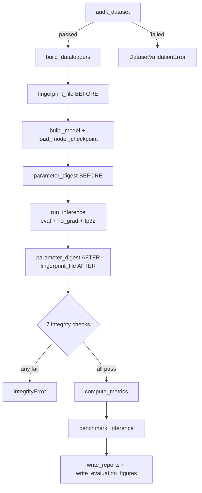

# Metrics

Two distinct metric systems exist: per-epoch training metrics
([src/training/metrics.py](../src/training/metrics.py)) and the evaluation metric
suite ([src/evaluation/metrics.py](../src/evaluation/metrics.py)).

## Training metrics

`EpochMetrics` ([src/training/metrics.py:41](../src/training/metrics.py)) —
one record per epoch, written to `results/history.csv` in this column order
(`HISTORY_FIELDNAMES`, [:11](../src/training/metrics.py)):

| Column | Computation | Source |
| --- | --- | --- |
| `epoch` | 1-based counter | [src/train.py](../src/train.py) |
| `train_loss` | Σ(batch loss × batch size) ÷ samples | [src/training/engine.py:55](../src/training/engine.py) |
| `train_accuracy` | correct argmax ÷ samples | [src/training/engine.py:56](../src/training/engine.py) |
| `val_loss` | same accumulator, no-grad pass | [src/training/engine.py:126](../src/training/engine.py) |
| `val_accuracy` | same | same |
| `learning_rate` | `optimizer.param_groups[0]["lr"]`, read **before** `scheduler.step()` | [src/training/optim.py](../src/training/optim.py) |
| `epoch_seconds` | `Timer` around train + validate | [src/utils.py:39](../src/utils.py) |
| `gpu_peak_mib` | `torch.cuda.max_memory_allocated()`, reset per epoch | [src/training/engine.py:152](../src/training/engine.py) |

Loss is sample-weighted, so a partial final batch cannot skew the epoch mean.

### Monitored metric and early stopping

| Setting | Default | Source |
| --- | --- | --- |
| `monitor` | `val_accuracy` | [configs/config.yaml](../configs/config.yaml) |
| `mode` | `max` | same |
| `patience` | 5 | same |
| `min_delta` | 0.001 | same |

`MONITORABLE_METRICS` = `{train_loss, train_accuracy, val_loss, val_accuracy}`
([src/training/metrics.py:25](../src/training/metrics.py)).

Improvement test ([src/training/early_stopping.py](../src/training/early_stopping.py)):

```
mode == max  ->  candidate > best + min_delta
mode == min  ->  candidate < best - min_delta
```

`EarlyStopping` tracks the best value **regardless** of `enabled`; disabling only
removes the stop condition, not best-checkpoint selection.

> Consequence of `min_delta`: an epoch may post the highest raw `val_accuracy`
> yet not be selected as best, because it did not clear `best + min_delta`.

## Evaluation metrics

All computed in one call to `compute_metrics`
([src/evaluation/metrics.py:234](../src/evaluation/metrics.py)) from a single set
of probabilities and targets.

### Overall — `OverallMetrics` ([:136](../src/evaluation/metrics.py))

| Metric | Computation | Line |
| --- | --- | --- |
| `loss` | Mean cross-entropy from the inference pass | passed in |
| `top1_accuracy` | `(predictions == targets).mean()` | [:300](../src/evaluation/metrics.py) |
| `top{k}_accuracy` | `argpartition` over top-k columns; returns `1.0` if `k >= num_classes` | [:518](../src/evaluation/metrics.py) |
| `macro_precision/recall/f1` | Unweighted mean over classes | [:526](../src/evaluation/metrics.py) |
| `weighted_precision/recall/f1` | `np.average(values, weights=support)` | [:531](../src/evaluation/metrics.py) |
| `macro_roc_auc_ovr` | Mean of defined per-class AUCs | [:538](../src/evaluation/metrics.py) |
| `weighted_roc_auc_ovr` | Support-weighted over defined AUCs | [:544](../src/evaluation/metrics.py) |
| `macro_pr_auc` / `weighted_pr_auc` | Same, using average precision | same |
| `expected_calibration_error` | See [Calibration](#calibration) | [:418](../src/evaluation/metrics.py) |

The JSON key for top-k is built dynamically as `f"top{self.top_k}_accuracy"`
([:160](../src/evaluation/metrics.py)) — with the default it is `top5_accuracy`.

### Per class — `ClassMetrics` ([:48](../src/evaluation/metrics.py))

`index`, `name`, `support`, `true_positives`, `false_positives`,
`false_negatives`, `precision`, `recall`, `f1`, `roc_auc`, `pr_auc`.

Confusion counts are derived from the matrix ([:263](../src/evaluation/metrics.py)):

```
tp = matrix.diagonal()
fp = matrix.sum(axis=0) - tp
fn = matrix.sum(axis=1) - tp        # support - tp
```

### Underlying implementations

| Metric | Provider | Line |
| --- | --- | --- |
| Confusion matrix | `sklearn.metrics.confusion_matrix` | [:262](../src/evaluation/metrics.py) |
| Precision / recall / F1 | `precision_recall_fscore_support(zero_division=0)` | [:268](../src/evaluation/metrics.py) |
| ROC-AUC (OvR) | `roc_auc_score` per binarised class | [:406](../src/evaluation/metrics.py) |
| PR-AUC | `average_precision_score` per binarised class | [:407](../src/evaluation/metrics.py) |
| Classification report | `classification_report(digits=4, zero_division=0)` | [:316](../src/evaluation/metrics.py) |
| Top-k accuracy | Hand-implemented, `np.argpartition` | [:518](../src/evaluation/metrics.py) |
| ECE / MCE | Hand-implemented binning | [:418](../src/evaluation/metrics.py) |

### Undefined-metric handling

`_per_class_curve_scores` ([:383](../src/evaluation/metrics.py)) computes ROC-AUC
and PR-AUC only when `0 < positives < n`. Otherwise the class records `None` and
is listed in `MetricLimitations` — it does **not** contribute `0.0` to averages.

`MetricLimitations` ([:176](../src/evaluation/metrics.py)) reports
`classes_without_support`, `classes_without_roc_auc`, `classes_without_pr_auc`,
`requested_top_k`, `effective_top_k`, `notes`, and `complete`.

In CSV, undefined values are written as an empty string
(`UNDEFINED_CSV_VALUE`, [:42](../src/evaluation/metrics.py)); in JSON they remain
`null` ([:79](../src/evaluation/metrics.py)).

## Calibration

`_calibration` ([:418](../src/evaluation/metrics.py)) buckets predictions by
max-probability confidence into `evaluation.calibration_bins` (default 15)
equal-width bins.

| Quantity | Formula |
| --- | --- |
| ECE | `Σ (count_b / N) × |accuracy_b − confidence_b|` |
| MCE | `max_b |accuracy_b − confidence_b|` over non-empty bins |
| `overconfidence` | `mean_confidence − accuracy` ([:119](../src/evaluation/metrics.py)) |

Bins are half-open on the left; the first bin also owns its lower edge so a
confidence of exactly 0 is never dropped (`_bucket_mask`,
[:462](../src/evaluation/metrics.py)).

> ECE is support-weighted; MCE is a worst-single-bucket statistic and can be
> dominated by a sparse bin. Both are reported.

## Inference benchmark

`benchmark_inference` ([src/evaluation/inference.py:208](../src/evaluation/inference.py)).

| Field | Meaning |
| --- | --- |
| `mean_batch_ms` | Mean per-batch wall time |
| `percentile_batch_ms` | p50, p90, p95, p99 (`LATENCY_PERCENTILES`, [:29](../src/evaluation/inference.py)) |
| `mean_image_ms` | Total measured ms ÷ measured images |
| `throughput_images_per_second` | measured images ÷ total measured seconds |
| `peak_gpu_memory_mib` | `max_memory_allocated` since reset |

Warm-up batches (`evaluation.benchmark.warmup_batches`, default 5) are executed
and discarded. Each batch is bracketed by `torch.cuda.synchronize`
([:297](../src/evaluation/inference.py)).

Scope, per the `note` field emitted into the JSON
([:130](../src/evaluation/inference.py)): latency covers **host-to-device
transfer plus forward pass**; data loading and decoding are excluded. The
end-to-end figure including loading is `InferenceOutputs.throughput`
([:62](../src/evaluation/inference.py)).

## Integrity checks

Seven checks, all enforced before metrics are computed
([src/evaluate.py:184](../src/evaluate.py)); `enforce` raises `IntegrityError` if
any fail ([src/evaluation/integrity.py:199](../src/evaluation/integrity.py)).

| Check | Verifies | Source |
| --- | --- | --- |
| Checkpoint File Unchanged | SHA-256 + size identical before/after | [:99](../src/evaluation/integrity.py) |
| Model Weights Unchanged | `state_dict` digest identical before/after | [:113](../src/evaluation/integrity.py) |
| Evaluation Mode | `model.training is False`, no parameter holds `.grad` | [:127](../src/evaluation/integrity.py) |
| Logits Finite | No NaN / Inf | [:140](../src/evaluation/integrity.py) |
| Probabilities Finite | No NaN / Inf | same |
| Probability Normalization | `max|rowsum − 1| <= tolerance`, values in `[0,1]` | [:154](../src/evaluation/integrity.py) |
| Split Coverage | Evaluated count equals split size | [:177](../src/evaluation/integrity.py) |

`parameter_digest` hashes every `state_dict` entry as float32 bytes
([:86](../src/evaluation/integrity.py)).

## Evaluation pipeline



## Exported artifacts

| File | Writer | Content |
| --- | --- | --- |
| `evaluation.json` | `write_json` | Full payload: overall, per-class, calibration, limitations, checkpoint, model, runtime, benchmark, integrity, class_to_idx |
| `per_class_metrics.csv` | `write_csv` | 11 columns per `PER_CLASS_FIELDNAMES` |
| `classification_report.txt` | `write_text` | sklearn report + limitation notes |
| `confusion_matrix.csv` | `write_csv` | Raw counts, rows = true class |
| `inference_benchmark.json` | `write_json` | Benchmark block |
| `confusion_matrix.png` | matplotlib | **Row-normalised** |
| `roc_curves.png` | matplotlib | Per-class + micro-average |
| `pr_curves.png` | matplotlib | Per-class + micro-average |
| `calibration_curve.png` | matplotlib | Reliability diagram + log-scale count histogram |

Writers: [src/evaluation/reporting.py:62](../src/evaluation/reporting.py) and
[src/visualization/evaluation_plots.py](../src/visualization/evaluation_plots.py).

The PNG is row-normalised while the CSV holds raw counts
([evaluation_plots.py](../src/visualization/evaluation_plots.py)); rows with zero
support are left at zero rather than dividing by zero.

Per-class legends are suppressed above `_MAX_LEGEND_CLASSES = 12`
([evaluation_plots.py](../src/visualization/evaluation_plots.py)); only the
micro-average keeps a legend entry.

## Metrics not implemented

| Metric | Status |
| --- | --- |
| Cohen's kappa | **Not Found** |
| Matthews correlation coefficient | **Not Found** |
| Balanced accuracy | **Not Found** |
| Brier score | **Not Found** |
| Per-class specificity | **Not Found** |
| Confidence intervals / bootstrapping | **Not Found** |
| Class-weighted loss | **Not Found** — `nn.CrossEntropyLoss()` is constructed with no `weight` ([src/train.py](../src/train.py)) |
